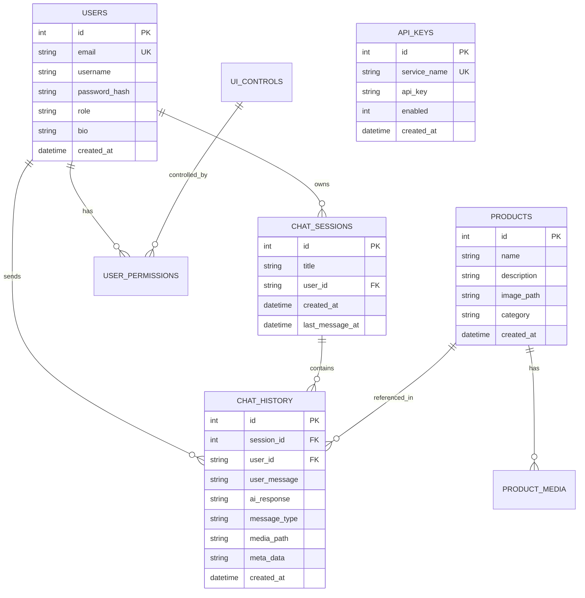

# توثيق نموذج البيانات وقاعدة البيانات (Data Model & Schema)

هذا المستند يشرح هيكلية البيانات في المشروع، بما في ذلك الربط بين قاعدة البيانات المحلية (SQLite) والسحابية (Firestore).

## 1. مخطط قاعدة البيانات (ER Diagram)

المخطط التالي يوضح الجداول الرئيسية والعلاقات بينها:

---

## 2. تفاصيل الجداول المحلية (SQLite)

يعتمد التطبيق على SQLite لإدارة البيانات التي تتطلب وصولاً سريعاً أو تعمل في وضع عدم الاتصال:

| الجدول | الوصف | الحقول الرئيسية |
| :--- | :--- | :--- |
| `users` | بيانات المستخدمين المحليين | `id`, `email`, `role`, `password_hash` |
| `chat_sessions` | جلسات الدردشة | `id`, `title`, `user_id` |
| `chat_history` | الرسائل داخل الجلسات | `session_id`, `user_message`, `ai_response`, `media_path` |
| `products` | الكتالوج الخاص بالمنتجات | `name`, `description`, `image_path` |
| `api_keys` | مفاتيح الخدمات (Gemini, TikTok, الخ) | `service_name`, `api_key`, `enabled` |
| `response_cache` | التخزين المؤقت للذكاء الاصطناعي | `input_hash`, `response_data`, `type` |

---

## 3. نماذج البيانات البرمجية (Data Models)

يتم تمثيل الجداول في الكود عبر كلاسات Dart (Entities) لسهولة التعامل معها:

### ChatMessage
يمثل رسالة واحدة في الدردشة، سواء كانت نصية، صورة، أو فيديو.
- **الحقول**: `id`, `role`, `content`, `type`, `mediaPath`, `state`.

### TikTokVideo
يمثل بيانات الفيديو المجلوب من TikTok للتحليل.
- **الحقول**: `id`, `videoUrl`, `title`, `author`, `thumbnailUrl`, `views`.

### Product
يمثل المنتج الذي يتم تحليله وتوليد محتوى له.
- **الحقول**: `id`, `name`, `description`, `imagePath`.

---

## 4. التكامل مع Firebase (Hybrid Model)

يتم مزامنة بعض هذه البيانات مع **Firestore** لضمان توفرها على أجهزة متعددة:

1.  **المستخدمين**: يتم ربط `user_id` المحلي بـ `Firebase Auth UID`.
2.  **الدردشات**: يتم نسخ الرسائل من `chat_history` إلى مجموعة `messages` في Firestore عبر `FirebaseChatService`.
3.  **الملفات**: تُرفع الصور والفيديوهات إلى `Firebase Storage` ويُخزن الرابط (URL) في قاعدة البيانات.
