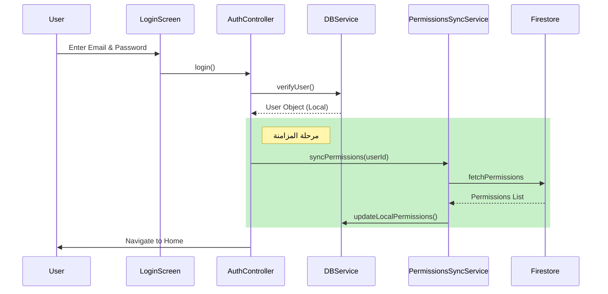

# تحليل هندسية نظام "Smart Content Creator"

يقدم هذا المستند تحليلاً شاملاً للمشروع بناءً على المبادئ الهندسية الأربعة المطلوبة، معتمداً على الكود المصدري الحالي (v13 من قاعدة البيانات).

## 1. نمذجة العمليات (Process Modeling)

### مخطط الإجراءات الوظيفية (BFD - Business Function Diagram)
يتمحور النظام حول تمكين صانع المحتوى من الإنتاج والتحليل، مدعوماً ببنية تحتية قوية لإدارة المستخدمين.

*   **1.0 إدارة الوصول والهوية (Identity Management)**
    *   1.1 تسجيل الدخول (Login): بريد إلكتروني وكلمة مرور (Email & Password).
    *   1.2 استعادة الوصول: إعادة تعيين كلمة المرور، التحقق الثنائي (OTP).
    *   1.3 إدارة الملف الشخصي: تحديث البيانات الحيوية (Bio, Username).
*   **2.0 إدارة المحتوى (Content Management)**
    *   2.1 إنشاء المحتوى (Creation): توليد نصوص وأفكار عبر AI Chat.
    *   2.2 معالجة المحتوى (Processing): تحميل فيديوهات (TikTok)، تحرير، دمج صوت وصورة (FFmpeg).
    *   2.3 تحليل المحتوى (Analytics): تقارير الانتشار الفيروسي (Viral Reports).
*   **3.0 الإدارة والتحكم (Administration)**
    *   3.1 مزامنة الصلاحيات (Permission Sync): التحكم في ظهور العناصر (Visible/Enabled) سحابياً.
    *   3.2 مراقبة الاستهلاك: تتبع استخدام Tokens ومكالمات API.

---

## 2. لغة النمذجة الموحدة (UML)

### أ. مخطط حالات الاستخدام (Use Case Diagram)

#### الممثلون (Actors)
1.  **صانع المحتوى (Content Creator - User):** المستخدم الأساسي الذي يستفيد من أدوات التوليد والتحرير.
2.  **المدير (Admin):** المسؤول عن النظام، يمتلك صلاحيات حصرية للتحكم في الميزات والمستخدمين.
3.  **نظام الذكاء الاصطناعي (AI System):** ممثل "خارجي" (System Actor) يستجيب للطلبات.

#### توصيف العينات (Sample Use Cases)

| حالة الاستخدام | الممثل | الوصف | الشروط المسبقة | السيناريو |
| :--- | :--- | :--- | :--- | :--- |
| **توليد فكرة فيديو** | Creator | طلب سيناريو أو فكرة جديدة من الـ AI | تسجيل الدخول | 1. يختار "AI Chat" 2. يكتب "أفكار طبخ" 3. النظام يعرض 5 أفكار. |
| **تحرير فيديو** | Creator | قص أو إضافة فلاتر لفيديو | وجود ملف فيديو | 1. يرفع فيديو 2. يختار فلتر "سينمائي" 3. النظام يعالج الفيديو (FFmpeg). |
| **تعطيل ميزة** | Admin | إخفاء زر "محرر الفيديو" عن مستخدم | صلاحية Admin | 1. يختار المستخدم 2. يعدل "Video Editor" إلى Hidden 3. النظام يحدث السحابة. |

### ب. مخطط الفئات (Class Diagram - Core Classes)

بناءً على الكود الفعلي:

*   **`AuthController`**:
    *   `login(email, password)`: التحقق من البيانات.
    *   `syncPermissions()`: بدء المزامنة بعد الدخول.
    *   `user`: كائن المستخدم الحالي.
*   **`DBService`**:
    *   `users_table`: إدارة بيانات المستخدمين.
    *   `chat_history_table`: تخزين المحادثات محلياً.
    *   `provider_usage_table`: تتبع الاستهلاك.
*   **`PermissionsSyncService`**:
    *   `syncUserPermissionsFromCloud(userId)`: جلب الصلاحيات.
    *   `setupRealtimeSync()`: الاستماع للتحديثات الحية.
*   **`FfmpegService`**:
    *   `extractFrame()`: استخراج صورة مصغرة.
    *   `enhanceVideo()`: تحسين الجودة ومعالجة الفيديو.

### ج. مخطط التسلسل (Sequence Diagram): "عملية المصادقة والمزامنة"

---

## 3. الخوارزميات (Algorithms)

### خوارزمية مزامنة الصلاحيات (Cloud-Local Sync Algorithm)
تستخدم هذه الخوارزمية لضمان تطابق الإعدادات المحلية مع التحكم السحابي.

1.  **البدء**: استلام `userId`.
2.  **الخطوة 1**: جلب كل الصلاحيات من مجموعة `user_permissions` في Firestore حيث `uid == userId`.
3.  **الخطوة 2**: تكرار (Loop) لكل وثيقة مسترجعة:
    *   استخرج `control_name`، `visible`، `enabled`.
    *   نفذ استعلام `INSERT OR REPLACE` في جدول `user_permissions` المحلي في SQLite.
4.  **الخطوة 3**: استدعاء دالة `setupRealtimeSync(userId)`:
    *   فتح `Stream` على نفس المجموعة.
    *   عند حدوث حدث `modified`: تحديث القاعدة المحلية فوراً.
    *   بث حدث تحديث للواجهة `update()` لإعادة بناء الـ Widgets المتأثرة.
5.  **النهاية**: عرض رسالة نجاح.

### خوارزمية معالجة الفيديو (Video Enhancement)
توجد في `FfmpegService.enhanceVideo`:

1.  **المدخلات**: مسار الفيديو، سلسلة الفلاتر، نسبة العرض (Ratio).
2.  **التحقق**: إذا كان هناك `targetRatio` محدد (مثل 9:16):
    *   أضف فلتر `scale=...:force_original_aspect_ratio` وسلسلة `crop` لضبط الأبعاد.
3.  **التنفيذ**: بناء أمر FFmpeg:
    *   `-i input`
    *   `-vf filters` (الفلاتر المرئية)
    *   `-c:v libx264` (إعادة تشفير الفيديو)
    *   `-c:a copy` (نسخ الصوت دون تعديل للسرعة)
4.  **المعالجة**: تنفيذ الأمر وانتظار `ReturnCode`.
5.  **النتيجة**: إرجاع مسار الملف الجديد أو `null` عند الخطأ.

---

## 4. نمذجة البيانات (Data Modeling)

### المخطط العلائقي (ERD) - قاعدة البيانات المحلية (v13)

#### الكيانات الرئيسية (Entities)

1.  **`Users` (المستخدمون)**
    *   `id` (PK): المعرف الرقمي.
    *   `email`: البريد (فريد).
    *   `role`: الدور (user/admin).
    *   `password_hash`: كلمة المرور المشفرة.

2.  **`UI_Controls` (عناصر التحكم)**
    *   `id` (PK).
    *   `control_name`: المعرف البرمجي (Unique).
    *   `category`: التصنيف (Screen, Button).

3.  **`User_Permissions` (جدول الربط - Junction Table)**
    *   يربط بين `Users` و `UI_Controls`.
    *   `user_id` (FK).
    *   `control_id` (FK).
    *   `visible` (Boolean): هل يظهر؟
    *   `enabled` (Boolean): هل يمكن ضغطه؟

4.  **`Chat_History` (الأرشيف)**
    *   `session_id` (FK): يربط بجلسة محادثة.
    *   `user_message` & `ai_response`.
    *   `provider`: المزود المستخدم في التوليد.

5.  **`Generated_Content` (المحتوى المولد)**
    *   يخزن نتائج عمليات التوليد غير النصية (مثل الصور أو النصوص الطويلة).

#### العلاقات (Relationships)
*   **1:M (واحد لمتعدد):** المستخدم (`Users`) يملك العديد من الجلسات (`Chat_Sessions`).
*   **1:M (واحد لمتعدد):** الجلسة (`Chat_Sessions`) تحتوي على العديد من الرسائل (`Chat_History`).
*   **M:N (متعدد لمتعدد):** المستخدمون وعناصر التحكم يرتبطون عبر جدول `User_Permissions`.
