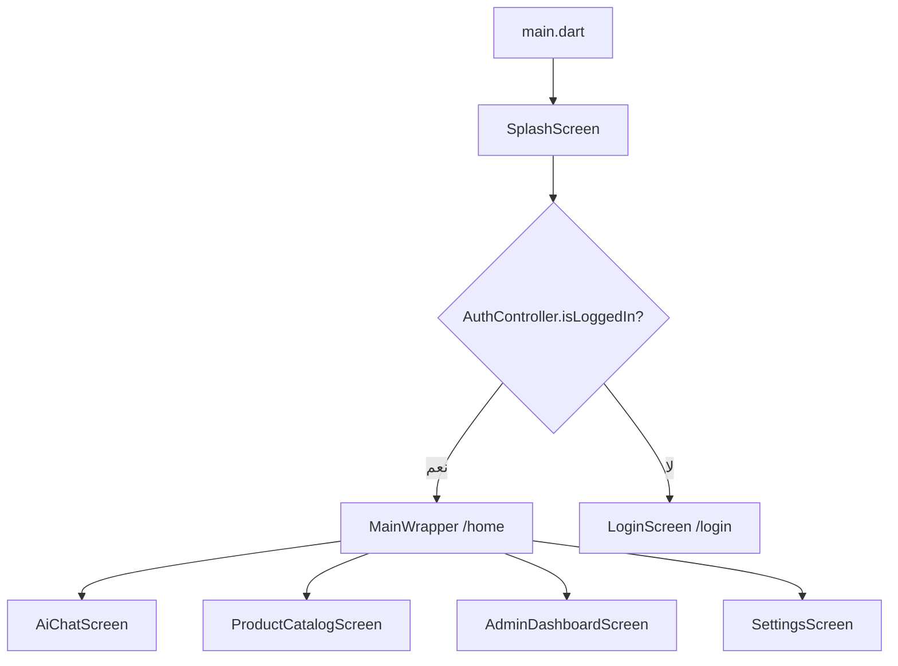

# التقرير التنفيذي الشامل — التدقيق الهندسي العميق
## مشروع Smart Content Creator (صانع المحتوى الذكي)
**تاريخ التدقيق:** 2026-08-24  
**الفرع:** main  
**آخر Commit:** f40bd21 (feat(catalog): add safe media repair from Indexes Store into permanent Parse Files)  
**نوع التدقيق:** READ-ONLY — استكشافي شامل  
**المدقق:** Antigravity AI Audit Engine  

---

## 1. ملخص النطاق والأرقام

| البند | القيمة |
|---|---|
| إجمالي الملفات المكتشفة (غير مستثناة) | **695** |
| ملفات Dart مصدرية (lib/) | **229 ملف** ≈ **2,684 KB** |
| إجمالي أسطر Dart (lib/) | ~**65,000+ سطر** |
| ملفات اختبار (test/ + integration_test/) | **18 ملف** |
| ملفات Cloud Functions (functions/) | **8 ملفات JS** |
| Routes مسجلة في GetMaterialApp | **18 مسار** |
| Controllers (GetX) | **15** |
| Services | **51+ ملف خدمة** |
| Models | **16** |
| Screens / شاشات | **~20 شاشة** |
| الاعتماديات في pubspec.yaml | **~62 حزمة** |
| الملفات المعدلة (unstaged) | **14 ملف** |
| الملفات غير المتعقبة | **8 مجلدات/ملفات** |

---

## 2. البنية المعمارية (خلاصة)

المشروع يتبع نمط **GetX MVC** مع فصل واضح نسبياً:
- **main.dart** → SplashScreen → AuthController يقرر `/home` أو `/login`
- **InitialBinding** يحقن ~70 خدمة ومتحكماً (permanent + lazyPut)
- **State Management:** GetX (Obx/.obs) حصرياً
- **Backend مزدوج:** Firebase + Back4App + Supabase
- **AI متعدد:** Gemini, Firebase AI, Back4App Gateway, Vertex AI, OpenRouter, وأكثر
- **التخزين المحلي:** SQLite (DBService) + SharedPreferences + FlutterSecureStorage

---

## 3. الاكتشافات الحرجة (Critical & High)

### 🔴 CRITICAL

| # | الاكتشاف | الملف | الحالة |
|---|---|---|---|
| C-1 | **مفاتيح Firebase (apiKey, appId, projectId) مكشوفة في main.dart:67** | `main.dart:66-73` | SECURITY_RISK |
| C-2 | **ملف `.env` في functions/ يحتوي أسرار Back4App غير مشفرة** | `functions/.env` | SECURITY_RISK |
| C-3 | **admin_dashboard_screen.dart = 137,640 bytes (3500+ سطر)** — ملف واحد يحتوي UI + business logic + network | `screens/admin_dashboard_screen.dart` | PERFORMANCE_RISK |
| C-4 | **product_catalog_screen.dart = 151,630 bytes (3264 سطر)** — أضخم ملف في المشروع | `screens/catalog/product_catalog_screen.dart` | PERFORMANCE_RISK |
| C-5 | **settings_screen.dart = 109,788 bytes** — شاشة واحدة لكل الإعدادات | `screens/settings_screen.dart` | PERFORMANCE_RISK |

### 🟠 HIGH

| # | الاكتشاف | الملف | الحالة |
|---|---|---|---|
| H-1 | **127 رابط فيديو Firebase Storage يُرجع HTTP 412 (Precondition Failed)** | تقرير `catalog_media_http_results.csv` | CONFIRMED_BROKEN |
| H-2 | **ملف Untitled-1.txt (335 KB) داخل lib/screens/** | `screens/Untitled-1.txt` | DEAD_CODE |
| H-3 | **ملف ai_chat_screen.dart.tmp (37 KB) داخل lib/screens/** | `screens/ai_chat_screen.dart.tmp` | DEAD_CODE |
| H-4 | **App Check في وضع Debug فقط (لا PlayIntegrity في الإنتاج)** | `main.dart:94` | SECURITY_RISK |
| H-5 | **CatalogController = 2060 سطر** — متحكم واحد يدير كل عمليات الكتالوج | `controllers/catalog_controller.dart` | PERFORMANCE_RISK |
| H-6 | **product_form_screen.dart = 98,961 bytes** | `screens/catalog/product_form_screen.dart` | PERFORMANCE_RISK |
| H-7 | **global_config يسمح بالقراءة بدون مصادقة (`allow read: if true`)** | `firestore.rules:35` | SECURITY_RISK |
| H-8 | **catalog_products يسمح بالقراءة العامة بدون مصادقة** | `firestore.rules:57` | SECURITY_RISK |
| H-9 | **Storage fallback rule يسمح بالقراءة والكتابة لأي مستخدم مسجل لأي مسار** | `storage.rules:28-29` | SECURITY_RISK |
| H-10 | **SecureStorageService يُحقن مرتين: مرة في main.dart:52 ومرة في InitialBinding:81** | `main.dart + initial_binding.dart` | DUPLICATED |

---

## 4. توزيع الاكتشافات حسب الخطورة

| الخطورة | العدد |
|---|---|
| 🔴 Critical | **5** |
| 🟠 High | **10+** |
| 🟡 Medium | **15+** |
| 🔵 Low | **20+** |
| ℹ️ Info | **30+** |

---

## 5. نسب التغطية

| البند | النسبة | الملاحظة |
|---|---|---|
| ملفات Dart تمت فهرستها | **100%** (229/229) | جرد آلي كامل |
| ملفات Dart تمت مراجعتها يدوياً بعمق | **~35%** | الملفات الكبرى والحرجة |
| Routes تم ربطها بشاشاتها | **100%** (18/18) | |
| Controllers تم فحص بنيتها | **100%** (15/15) | |
| Services تم تصنيفها | **100%** (51/51) | |
| تدفقات المستخدم المتتبعة | **12 تدفق رئيسي** | |
| الاختبارات المصنفة | **100%** (18/18) | لم تُشغَّل (BLOCKED_BY_ENVIRONMENT) |

---

## 6. القيود البيئية

1. **لم يتم تشغيل `flutter analyze`** — يتطلب `flutter pub get` أولاً (ممنوع بموجب قواعد الأمان).
2. **لم يتم تشغيل الاختبارات** — معظمها يتصل بخدمات حية (Firebase, Back4App).
3. **لم يتم بناء APK/AAB** — يتطلب تعديل الكاش.
4. **لم يتم التحقق من إصدارات الحزم عبر الشبكة** — صلاحية الشبكة غير متاحة.

---

## 7. التوصيات العاجلة (الأولوية القصوى)

1. **نقل مفاتيح Firebase والأسرار إلى `--dart-define` أو `flutter_dotenv`** ← CRITICAL
2. **حذف الملفات اليتيمة** (`Untitled-1.txt`, `.tmp`) ← HIGH
3. **تقسيم الملفات العملاقة** (admin_dashboard, product_catalog, settings_screen) ← HIGH
4. **تفعيل App Check بوضع PlayIntegrity للإنتاج** ← HIGH
5. **إصلاح قاعدة Storage fallback** (حصرها بمسارات محددة) ← HIGH
6. **ترحيل فيديوهات Firebase Storage المعطلة** (127 رابط HTTP 412) ← HIGH

---

## 8. حالة Git بعد التدقيق

التدقيق أنشأ ملفات فقط داخل `reports/full_audit/` + أداة `tools/run_audit.py`.  
**لم يتم تعديل أي ملف مصدر من ملفات المشروع الأصلية.**
