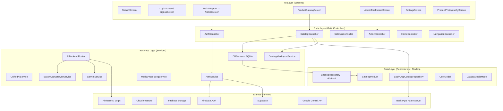

# الخريطة المعمارية والاعتماديات — Architecture & Dependencies
## مشروع Smart Content Creator

---

## 1. نقطة بدء التطبيق وتسلسل التهيئة

### تسلسل الإقلاع (Boot Sequence):

```
main() [main.dart:44]
├── WidgetsFlutterBinding.ensureInitialized()
├── SupabaseConfig.initialize() [core/config/supabase_config.dart]
├── SecureStorageService → Get.put (permanent) ⚠️ يُحقن مرتين
├── AppStorageService → Get.putAsync (permanent)
├── Firebase.initializeApp()
│   ├── Web: FirebaseOptions مضمنة في الكود (apiKey مكشوف)
│   └── Native: google-services.json / GoogleService-Info.plist
├── FirebaseFirestore.settings (offline + unlimited cache)
├── FirebaseAppCheck.activate (DEBUG provider فقط!)
├── Get.put<bool>(firebaseInitialized, tag: 'firebaseInitialized')
├── ApiController → Get.put (permanent)
├── AiImageGenerationService → Get.put (permanent) ⚠️ يُحقن أيضاً lazily في InitialBinding
└── runApp(SmartContentCreatorApp)
    └── ScreenUtilInit → GetMaterialApp
        ├── initialBinding: InitialBinding()
        ├── home: SplashScreen
        └── getPages: [18 مسار]
```

### InitialBinding [core/bindings/initial_binding.dart:76-195]

يُحقن فيه ~70 خدمة/متحكم في 5 مراحل:

1. **خدمات الإقلاع الحرجة (permanent):**
   - SecureStorageService, DBService
   - AuthService, FirestoreUserService
   - GlobalConfigService (إذا Firebase جاهز)
   - PermissionsSyncService, PermissionsController
   - AuthController, SettingsController
   - CatalogController

2. **Controllers (lazyPut fenix):**
   - ChatHistoryController, HomeController, NavigationController
   - ThemeController, HomeDashboardController

3. **Chat Core Services:**
   - ChatStateService, ChatRepository, ChatBrainService
   - UnifiedAIService, ChatTaskDistributor

4. **AI Services (~20 خدمة):**
   - GeminiService, Back4AppGatewayService, FirebaseAiLogicService
   - AIBackendRouter, VertexAiService, KlingService, HiggsfieldService
   - OpenRouterVideoService, GoogleVeoService, AiImageGenerationService
   - GeminiAudioService, GeminiVisionService, VisionProductService
   - ProductMemoryService, ProductMatchingService, RemoteSegmentationService
   - BackgroundRemovalService, SceneDirectorService, MediaMergeService
   - ModelCapabilityService

5. **Media, Social, Search, Pipeline:**
   - MediaProcessingService, VideoPipelineService, GeminiDirectorService
   - FfmpegService, RemotionService, YoutubeStreamService
   - SerpApiMasterService + 12 محرك بحث فرعي
   - TikTokService, TelegramService
   - IntentClassifierService, ChatSmartAgent, AIProvider, AIOrchestrator

---

## 2. طبقات المشروع



---

## 3. نظام إدارة الحالة

**النظام المستخدم:** GetX حصرياً

| النمط | الاستخدام |
|---|---|
| `.obs` / `Rx<T>` | جميع المتغيرات التفاعلية |
| `Obx(() => ...)` | ربط الواجهة بالحالة |
| `Get.find<T>()` | الوصول للمتحكمات والخدمات |
| `Get.put()` / `Get.lazyPut()` | حقن الاعتماديات |
| `Get.toNamed()` / `Get.offAllNamed()` | التنقل |
| `GetxController.onInit()` | تهيئة المتحكمات |

**لا يوجد:** Provider, Bloc, Riverpod, أو أي نظام آخر.

---

## 4. التخزين المحلي

| الوسيلة | الاستخدام | الملف |
|---|---|---|
| **SQLite** (sqflite) | كتالوج المنتجات المحلي، سجل المحادثات، الإعدادات | `services/db_service.dart` |
| **SharedPreferences** | إعدادات عامة، تفضيلات، حالة أول تشغيل | `core/storage/app_storage_service.dart` |
| **FlutterSecureStorage** | مفاتيح API، توكنات، أسرار | `services/secure_storage_service.dart` |
| **GetStorage** | تخزين سريع خفيف (مذكور في pubspec ولكن الاستخدام محدود) | - |

---

## 5. الخدمات الخارجية (External Services Map)

| الخدمة | الغرض | ملفات الاتصال | حالة التحقق |
|---|---|---|---|
| **Firebase Auth** | مصادقة المستخدمين (Email/Google) | `auth_service.dart`, `auth_controller.dart` | STATICALLY_VALID |
| **Cloud Firestore** | بيانات المستخدمين، الإعدادات، سجل النشاط | `firestore_user_service.dart`, `admin_controller.dart` | STATICALLY_VALID |
| **Firebase Storage** | وسائط الكتالوج والمحادثات | `firebase_storage_service.dart` | PARTIALLY_VERIFIED (HTTP 412 على فيديوهات قديمة) |
| **Firebase App Check** | حماية API | `main.dart:88-101` | LIKELY_BROKEN (Debug provider فقط) |
| **Firebase AI Logic** | Gemini عبر Firebase SDK | `firebase_ai_logic_service.dart` | STATICALLY_VALID |
| **Supabase** | مصادقة بديلة + تخزين صور الكتالوج | `supabase_config.dart`, عدة services | STATICALLY_VALID |
| **Back4App (Parse)** | Cloud Code للذكاء الاصطناعي + كتالوج المنتجات | `back4app_gateway_service.dart`, `back4app_catalog_repository.dart` | STATICALLY_VALID |
| **Google Gemini** | توليد المحتوى والمحادثة الذكية | `gemini_service.dart` | NEEDS_RUNTIME_TEST |
| **SerpApi** | بحث Google Lens, Trends, Shopping, إلخ | `serpapi_services.dart`, `serpapi_master_service.dart` | NEEDS_RUNTIME_TEST |
| **TikTok** | نشر ومزامنة المحتوى | `tiktok_service.dart`, `tiktok_account_service.dart` | NEEDS_RUNTIME_TEST |
| **Instagram** | مزامنة المحتوى | `instagram_service.dart` | NEEDS_RUNTIME_TEST |
| **Telegram** | مشاركة المحتوى | `telegram_service.dart` | NEEDS_RUNTIME_TEST |
| **WhatsApp** | مزامنة الوسائط | `whatsapp_sync_service.dart` | NEEDS_RUNTIME_TEST |

---

## 6. مشاكل معمارية مكتشفة

### 6.1 ملفات عملاقة تنتهك Single Responsibility

| الملف | الأسطر | الحجم | المشكلة |
|---|---|---|---|
| `product_catalog_screen.dart` | 3264 | 151 KB | UI + Business Logic + Network في ملف واحد |
| `admin_dashboard_screen.dart` | ~3500 | 137 KB | لوحة تحكم كاملة في ملف واحد |
| `settings_screen.dart` | ~2500 | 109 KB | كل الإعدادات في شاشة واحدة |
| `product_form_screen.dart` | ~2200 | 98 KB | نموذج المنتج بكل حقوله |
| `catalog_controller.dart` | 2060 | 82 KB | متحكم واحد لكل عمليات الكتالوج |
| `auth_controller.dart` | ~1400 | 51 KB | مصادقة + إدارة جلسة + ملف شخصي |

### 6.2 حقن مزدوج (Double Registration)

- `SecureStorageService` يُسجل في `main.dart:52` و `initial_binding.dart:81`
- `AiImageGenerationService` يُسجل في `main.dart:121` و `initial_binding.dart:132`
- **التأثير:** GetX يعيد استخدام أول instance مسجل؛ لكنه يُربك القراءة والصيانة.

### 6.3 غياب طبقة Repository واضحة

- `CatalogRepository` (abstract) + `Back4AppCatalogRepository` موجودان.
- لكن معظم الخدمات الأخرى (Auth, AI, Social) تتصل مباشرة بالـ Backend بدون Repository Pattern.
- **التأثير:** صعوبة الاختبار والاستبدال.
