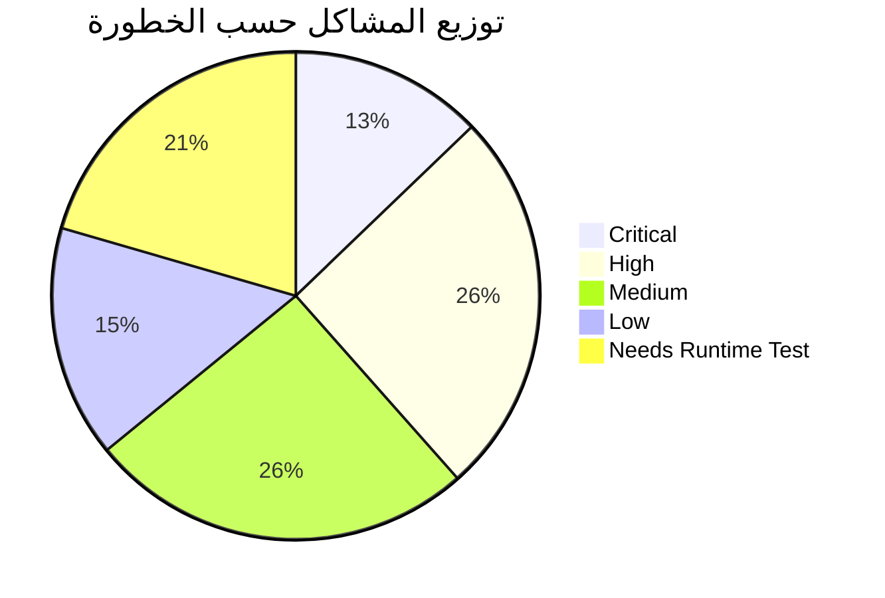

# المشاكل المؤكدة والمحتملة — Confirmed & Potential Issues

---

## 1. مشاكل مؤكدة (CONFIRMED) بالأدلة

### 🔴 CRITICAL Issues

| # | المشكلة | الملف:السطر | الدليل | التصنيف |
|---|---|---|---|---|
| C-1 | مفاتيح Firebase مكشوفة في الكود | `main.dart:66-73` | `apiKey: 'AIzaSyBQln...'` موجود حرفياً | SECURITY_RISK |
| C-2 | قاعدة Storage fallback تسمح بالكتابة لأي مسار | `storage.rules:28-29` | `allow read, write: if request.auth != null` | SECURITY_RISK |
| C-3 | ملف واحد 151 KB = ProductCatalogScreen | `product_catalog_screen.dart` | 3264 سطر في ملف واحد | MAINTAINABILITY |
| C-4 | ملف واحد 137 KB = AdminDashboardScreen | `admin_dashboard_screen.dart` | ~3500 سطر | MAINTAINABILITY |
| C-5 | Codebase ثانية في firebase.json تشير لمجلد غير موجود | `firebase.json:45` | `"source": "backend"` — **لا يوجد مجلد backend/** | CONFIRMED_BROKEN |

### 🟠 HIGH Issues

| # | المشكلة | الملف:السطر | الدليل | التصنيف |
|---|---|---|---|---|
| H-1 | 127 رابط فيديو Firebase Storage يُرجع HTTP 412 | `catalog_media_http_results.csv` | تم فحصها فعلياً عبر HTTP probe | CONFIRMED_BROKEN |
| H-2 | `Untitled-1.txt` (335 KB) في lib/screens/ | `screens/Untitled-1.txt` | ملف نصي ليس Dart — لا يُستخدم | DEAD_CODE |
| H-3 | `ai_chat_screen.dart.tmp` (37 KB) في lib/screens/ | `screens/ai_chat_screen.dart.tmp` | ملف مؤقت يتيم | DEAD_CODE |
| H-4 | App Check = Debug provider فقط | `main.dart:94` | `AndroidProvider.debug` | SECURITY_RISK |
| H-5 | global_config مقروء بدون مصادقة | `firestore.rules:35` | `allow read: if true` | SECURITY_RISK |
| H-6 | chat_media يمكن لأي مستخدم مسجل قراءة أي محادثة | `storage.rules:11-13` | لا يتحقق من ملكية chatId | SECURITY_RISK |
| H-7 | SecureStorageService يُحقن مرتين | `main.dart:52` + `initial_binding.dart:81` | حقن مزدوج | DUPLICATED |
| H-8 | AiImageGenerationService يُحقن مرتين | `main.dart:121` + `initial_binding.dart:132` | حقن مزدوج | DUPLICATED |
| H-9 | `/home` و `/main` مسار مكرر لنفس الشاشة | `main.dart:198-202` | كلاهما يؤدي لـ MainWrapper | DUPLICATED |
| H-10 | لا يوجد Route Guard / Middleware | `main.dart:173+` | getPages بدون middleware | SECURITY_RISK |

### 🟡 MEDIUM Issues

| # | المشكلة | الملف | الدليل | التصنيف |
|---|---|---|---|---|
| M-1 | CatalogController = 2060 سطر | `catalog_controller.dart` | 82 KB ملف واحد | MAINTAINABILITY |
| M-2 | auth_controller.dart = 51 KB | `auth_controller.dart` | ~1400 سطر | MAINTAINABILITY |
| M-3 | settings_screen.dart = 109 KB | `settings_screen.dart` | ~2500 سطر | MAINTAINABILITY |
| M-4 | product_form_screen.dart = 98 KB | `product_form_screen.dart` | ~2200 سطر | MAINTAINABILITY |
| M-5 | ai_chat_screen.dart = 84 KB | `ai_chat_screen.dart` | ~2000 سطر | MAINTAINABILITY |
| M-6 | widget_test.dart شبه فارغ | `test/widget_test.dart` | 200 bytes فقط | TEST_COVERAGE |
| M-7 | 0% تغطية Widget tests | `test/` | لا يوجد widget test فعال | TEST_COVERAGE |
| M-8 | CatalogProduct model ضخم (~54 حقل) | `catalog_product_model.dart` | 31 KB | MAINTAINABILITY |
| M-9 | `flutter_lints` + `lints` مثبتان معاً | `pubspec.yaml` | تكرار dev dependencies | DUPLICATED |
| M-10 | بيانات المنتجات على 3 مخازن مختلفة | متعدد | SQLite + Back4App + Firestore | DATA_INTEGRITY |

### 🔵 LOW Issues

| # | المشكلة | الملف | التصنيف |
|---|---|---|---|
| L-1 | تعليقات بالعربية والإنجليزية مختلطة | متعدد | STYLE |
| L-2 | Emoji في التعليقات (🚀🔥⚡) | متعدد | STYLE |
| L-3 | `enableLog: true` في الإنتاج | `main.dart:155` | PERFORMANCE |
| L-4 | `processTextConfig` استخدام قديم | `pubspec.yaml` | DEPRECATION |
| L-5 | video_player_win قد لا يدعم جميع التنسيقات | `pubspec.yaml` | COMPATIBILITY |
| L-6 | `.vscode/` مُعلق في .gitignore | `.gitignore:24` | CONFIG |

---

## 2. مشاكل محتملة تحتاج فحص Runtime

| # | المشكلة المحتملة | الملف | التصنيف |
|---|---|---|---|
| R-1 | Memory leak في AnimationControllers | شاشات متعددة | NEEDS_RUNTIME_TEST |
| R-2 | Race condition في SplashScreen timeout | `splash_screen.dart:79` | NEEDS_RUNTIME_TEST |
| R-3 | SQLite migration عند تحديث schema | `db_service.dart` | NEEDS_RUNTIME_TEST |
| R-4 | Back4App API rate limits | `back4app_gateway_service.dart` | NEEDS_RUNTIME_TEST |
| R-5 | Excel formula injection | `catalog_xlsx_import_service.dart` | NEEDS_RUNTIME_TEST |
| R-6 | WebView URL validation | ملفات webview | NEEDS_RUNTIME_TEST |
| R-7 | Firestore offline cache corruption | `main.dart:81-84` | NEEDS_RUNTIME_TEST |
| R-8 | Large list rendering performance (3000+ products) | `product_catalog_screen.dart` | NEEDS_RUNTIME_TEST |

---

## 3. إحصائيات المشاكل

| الخطورة | العدد | النسبة |
|---|---|---|
| 🔴 Critical | 5 | 13% |
| 🟠 High | 10 | 26% |
| 🟡 Medium | 10 | 26% |
| 🔵 Low | 6 | 15% |
| 🔍 Needs Runtime | 8 | 20% |
| **الإجمالي** | **39** | **100%** |
