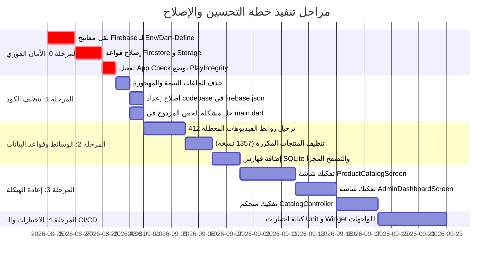

# التوصيات وخارطة طريق الإصلاح الشاملة — Recommendations & Remediation Roadmap
## مشروع Smart Content Creator (صانع المحتوى الذكي)

---

## 1. المصفوفة الزمنية للأولويات (Priority Remediation Matrix)

---

## 2. جدول الإجراءات التفصيلي خطوة بخطوة (Actionable Steps)

### المرحلة 0: سد الثغرات الأمنية الحرجة (P0 - Immediate)
1. **حماية مفاتيح Firebase:**
   - نقل معاملات التهيئة في `lib/main.dart` من الأكواد المباشرة إلى متغيرات بيئة تمرر أثناء البناء عبر `--dart-define=FIREBASE_API_KEY=...` أو استخدام مكتبة إدارة البيئات الآمنة.
2. **تشديد قواعد Storage و Firestore:**
   - تعديل `storage.rules` لحذف القاعدة العامة المفتوحة `match /{allPaths=**}`، وقصر الكتابة على مسارات محددة يتم التحقق فيها من تطابق `request.auth.uid`.
   - تعديل `firestore.rules` لمجموعة `global_config` لمنع القراءة المجهولة وحصرها بالمستخدمين المسجلين أو المصرح لهم.
3. **تفعيل حماية App Check الحقيقية:**
   - استبدال `AndroidProvider.debug` بمزود الإنتاج `AndroidProvider.playIntegrity` لحماية الـ APIs من إساءة الاستخدام.

---

### المرحلة 1: التنظيف الهندسي وإزالة الازدواجية (P1 - High)
1. **حذف الملفات الزائدة والمهجورة:**
   - حذف `lib/screens/Untitled-1.txt` و `lib/screens/ai_chat_screen.dart.tmp`.
2. **تصحيح إعدادات Firebase Deploy:**
   - تصحيح إعداد `firebase.json` بحذف مسار codebase غير الموجود (`"source": "backend"`).
3. **إلغاء الحقن المزدوج:**
   - إبقاء حقن `SecureStorageService` و `AiImageGenerationService` في مكان وحيد موثق (داخل `InitialBinding`) وإزالته من `main.dart`.
4. **توحيد المسارات:**
   - إزالة المسار المكرر `/main` والاعتماد التام على `/home`.

---

### المرحلة 2: سلامة البيانات واستقرار الوسائط (P2 - Medium)
1. **معالجة روابط الفيديوهات المعطلة:**
   - استكمال تشغيل خدمة إصلاح الوسائط `safe media repair` لتحويل روابط Firebase القديمة (التي تُرجع 412) إلى Parse Files دائمة ونظيفة على خوادم Back4App.
2. **إزالة المنتجات المكررة:**
   - تنفيذ عملية تصفية وتوحيد لقاعدة بيانات الكتالوج المحلية والسحابية لإزالة الـ 1357 نسخة مكررة بناءً على البصمة الفريدة (Title + Image Hash).
3. **تحسين أداء SQLite:**
   - إضافة فهارس على حقول التصنيف والحالة والتاريخ وتطبيق الـ Pagination.

---

### المرحلة 3: التفكيك المعماري للملفات العملاقة (P3 - Maintainability)
1. **تفكيك `ProductCatalogScreen` (151 KB) و `AdminDashboardScreen` (137 KB):**
   - نقل كل تبويب وقسم ويدجت فرعي إلى ملف منفصل داخل مجلد `sections/` و `widgets/`.
2. **تجزئة `CatalogController` (82 KB):**
   - فصل مسؤوليات الاستيراد والتصدير والمزامنة في متحكمات أصغر مسؤولة ومترابطة.

---

### المرحلة 4: الجودة والاختبارات الشاملة (P4 - Quality & Reliability)
1. **إضافة Unit Tests مع Mocks:**
   - إنشاء اختبارات وحدة لمتحكمات `AuthController`, `CatalogController`, وخدمة `AIBackendRouter`.
2. **تغطية الشاشات باختبارات Widget:**
   - اختبار تدفق الشاشات الحيوية: Splash -> Login -> Home -> Catalog.
3. **إعداد GitHub Actions Workflow:**
   - بناء Pipeline للتحقق الآلي من `flutter analyze` ومنع إدخال أسرار أو ملفات عملاقة مستقبلاً.
