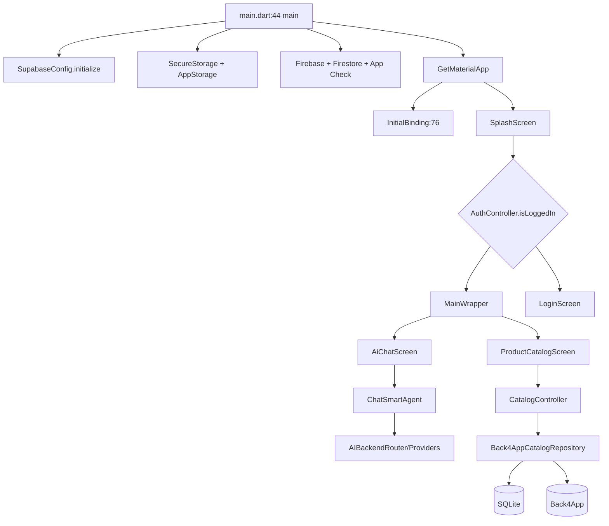

# الخريطة المعمارية

الحالة العامة: `PARTIALLY_VERIFIED`؛ الفهرسة ساكنة ولم يُشغّل التطبيق.

## بدء التطبيق

- `lib/main.dart:44-124`: Flutter binding → Supabase → التخزين → Firebase/Firestore/App Check → حقن الخدمات → runApp.
- `lib/main.dart:140-170`: GetMaterialApp + InitialBinding + Splash.
- `lib/core/bindings/initial_binding.dart:76-194`: 81 موقع تسجيل eager/lazy، مع تسجيلات إضافية في main.
- GetX هو مدير الحالة الأساسي، مع نحو 104 `Obx` و92 `setState`؛ يوجد مزج GetX/StatefulWidget.

## الطبقات

| الطبقة | أمثلة | المسؤولية | الملاحظة |
|---|---|---|---|
| UI | `lib/screens`, `lib/widgets`, `lib/ai/ui` | العرض والتفاعل | ملفات ضخمة تمزج business logic |
| Controllers | `lib/controllers` | state/orchestration | Catalog/Auth/Settings متعددة المسؤوليات |
| Services | `lib/services`, `lib/core/services` | شبكة/AI/media/auth | عملاء HTTP غير موحدين |
| Repository | `lib/core/repositories` | مزامنة الكتالوج | Back4App + SQLite + outbox |
| Models | `lib/models`, `lib/core/models` | serialization/domain | contract tests محدودة |
| Storage | DBService/DatabaseHelper/AppStorage | SQLite/GetStorage/SecureStorage | أكثر من مصدر حقيقة |

## الوحدات الرئيسية

- `AuthController` — `lib/controllers/auth_controller.dart:25-1379`: المصادقة والتنقل والروابط والملف؛ آثار Firebase/SQLite/navigation.
- `CatalogController` — `lib/controllers/catalog_controller.dart:30-2059`: التحميل والبحث والاستيراد والحذف والمزامنة؛ آثار SQLite/Back4App/files.
- `SettingsController` — `lib/controllers/settings_controller.dart:28-937`: المفاتيح والمزودون واختبار الشبكة والتحديثات.
- `ChatSmartAgent` — `lib/ai/chat_smart_agent.dart:43-803`: تنسيق الرسائل والـAI والوسائط.
- `Back4AppCatalogRepository` — `lib/core/repositories/back4app_catalog_repository.dart:11-750`: cache/remote sync/outbox.

## خروقات الفصل

- CatalogController يجمع UI state وExcel/network/database/media.
- الشاشات الكبرى تحوي network/storage logic مباشرة.
- `LogService` مكرر في مسارين.
- لا اعتماد دائري مؤكد؛ analyzer/package graph محجوب بيئيًا.
